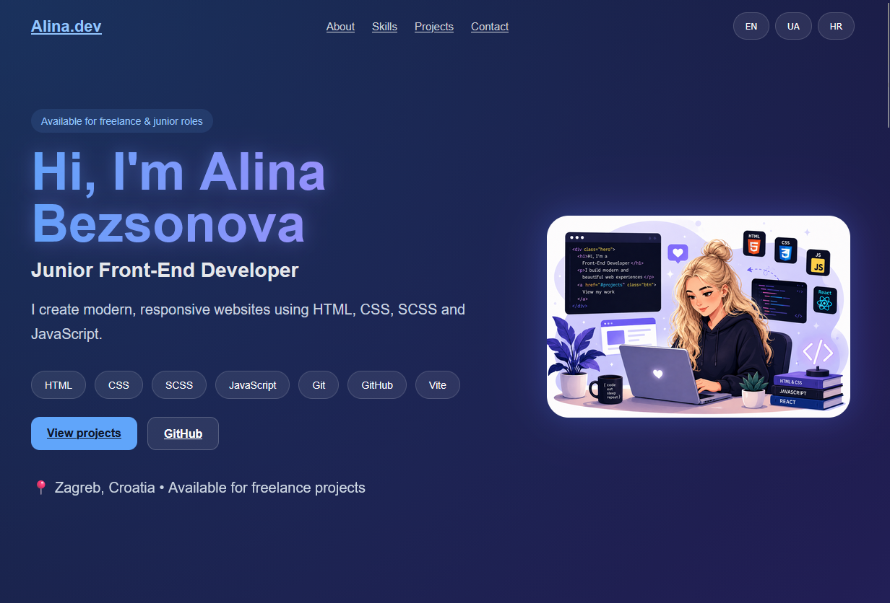

# 👋 Hi, I'm Alina Bezsonova

### Junior Front-End Developer

🌍 Zagreb, Croatia

## 🌐 Live Portfolio

https://balina83.github.io/portfolio/

      

## 🚀 About Me

I am a Junior Front-End Developer who completed the Front-End Basic course at Hillel IT School.

I enjoy creating responsive websites, improving user interfaces and learning modern web technologies.

## 🛠 Tech Stack

* HTML5
* CSS3
* SCSS
* JavaScript
* Vite
* Git
* GitHub
* Responsive Design

## 📂 Projects

### ⚖️ Hlegal

Responsive multi-page website for a law company.

🔗 Live Demo:
https://balina83.github.io/homework-1/

### 🏢 WebStudio

Modern landing page for a digital agency.

🔗 Live Demo:
https://balina83.github.io/webstudio/webstudio/

### 👩‍💻 Portfolio

Personal portfolio website showcasing projects, certificates and contact information.

🔗 Live Demo:
https://balina83.github.io/portfolio/

## 🏆 Certificates

* Front-End Basic — Hillel IT School
* Prompt Engineering & AI Tools — Hillel IT School

## 📫 Contact

📧 Email: [alina.bessonova83@gmail.com](mailto:alina.bessonova83@gmail.com)

💻 GitHub:
https://github.com/BALINA83

🔗 LinkedIn:
https://www.linkedin.com/

---

⭐ Thank you for visiting my portfolio!
